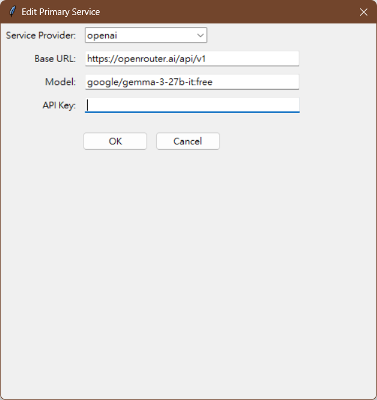

# Discord Translation Bot

A Discord bot that automatically translates messages between different language channels, featuring a multi-layered fallback translation system and a graphical user interface for easy configuration.

## Features

- **Multi-language Support**: Automatically detects and translates messages across configured language channels
- **Channel Types**: 
  - Standard (read/write)
  - Read-only (messages only replicated, not translated)
  - Write-only (translation results only)
- **Fallback Translation System**: 
  - Primary translation service (supports OpenAI API service providers, Azure, local Ollama support, etc.)
  - Multiple configurable remote fallback services
  - Local Ollama fallback support
- **Smart Text Processing**:
  - CJK character-aware text length calculation
  - Automatic language separation for long texts
  - Markdown-preserved translations
- **Message Editing Support**: Automatically updates translations when original messages are edited
- **Attachment Handling**: Displays inline images and attachment links
- **Graphical User Interface**: Easy configuration through a visual interface
- **Configuration Management**: YAML-based configuration with UI editor

## Requirements

- Python 3.8 or higher
- Discord Bot Token
- API keys for translation services (OpenRouter, Azure, etc.)
- Optional: Local Ollama installation

## Quick Installation

### Windows
1. Double-click `install.bat`
2. Follow the on-screen instructions

### Linux/Ubuntu
1. Download `install.sh`
2. Make it executable: `chmod +x install.sh`
3. Run: `./install.sh`

## Starting the Bot

After installation, you have the following options:

### Windows
- `start-bot.bat` - Start bot only (command line)
- `start-ui.bat` - Start UI (can control bot from within UI)

### Linux/Ubuntu
- `./start-bot.sh` - Start bot only
- `./start-ui.sh` - Start UI (can control bot from within UI)

## Configuration

### First-Time Setup

1. Run the UI to generate `config.yaml` and configure settings:
   - Windows: Double-click `start-ui.bat`
   - Linux: Run `./start-ui.sh`
2. Configure your Discord token:
   - Get a token from [Discord Developer Portal](https://discord.com/developers/applications)
   - Enable Message Content Intent and required permissions
   - Add the token to your configuration
3. Set up translation services using the UI
4. Save configuration using the "Save Configuration" button
5. Start the bot using the "Start Bot" button in the UI

### Using the UI

The graphical interface provides complete control:

#### Configure Discord token and API keys
First get your [Discord token](https://docs.unified.to/guides/how_to_get_your_discord_oauth_2_credentials_and_bot_token "Tutorial")


#### Set up translation services (primary and fallbacks)
The setup for primary service and fallback services is similar



You can also use local LLM translation through Ollama, set the URL to `http://localhost:11434`


Enable remote or local fallback services


#### Add/edit/delete channels with different types
Use language tags based on [ISO 693-3](https://en.wikipedia.org/wiki/ISO_639-3 "Wikipedia") to set translation languages

You can choose channel types:
- Standard (can read and receive translations)
- read_only (only reads messages, doesn't receive translations)
- write_only (only receives translations, doesn't read messages)

Please copy channel IDs from Discord yourself


#### Configure translation settings (tone, special instructions)
You can additionally set translation tone, special instructions, and character threshold for when to process different languages separately


#### Save settings and activate the bot


#### Monitor bot status and logs
Send a message to test


Translations will be sent to the configured channels at once


All channels will synchronize content in their configured languages


### Manual Configuration Example

Directly edit `config.yaml`:

```yaml
api_keys:
  discord_token: YOUR_DISCORD_TOKEN

channels:
  standard:
    en: [1234567890123456789]
    zh-TW: [9876543210987654321]
  read_only:
    ja: [1111111111111111111]
  write_only:
    ko: [2222222222222222222]

translation_services:
  primary:
    provider: openrouter
    base_url: https://openrouter.ai/api/v1
    model: google/gemma-3-27b-it
    api_key: YOUR_API_KEY
  
  enable_remote_fallback: true
  remote_fallbacks:
    - provider: openrouter
      base_url: https://openrouter.ai/api/v1
      model: google/gemma-3-12b-it
      api_key: YOUR_API_KEY
    - provider: ollama
      base_url: http://localhost:11434
      model: gemma3:4b-it-qat
      api_key: null
      timeout: 90
  
  enable_ollama_fallback: true

settings:
  translation_tone: ''  # casual, formal, professional, friendly
  special_instructions: ''
  language_separation_threshold: 1200
```

## Bot Permissions

Your Discord bot needs these permissions:
- Read Messages
- Send Messages
- Use Slash Commands (optional)
- Read Message History
- Manage Messages (for editing translations)

## Translation Services

### Supported Providers

1. **OpenRouter or other providers supporting OpenAI API**
   - Multiple model options
   - Reasonable pricing
   - Easy setup

2. **Azure OpenAI**
   - Enterprise-grade
   - Requires Azure subscription
   - More configuration needed

3. **Ollama**
   - Local deployment
   - No API costs
   - Requires local setup

### Adding New Providers

The system is designed to support OpenAI-compatible APIs. You can add new providers by:
- Adding their configuration in `remote_fallbacks`
- Ensuring they support OpenAI API format

## Advanced Features

### Language Separation

The bot automatically separates languages for translation when text exceeds a threshold, improving success rates for long texts containing CJK characters.

### Message Editing

When you edit a message in a watched channel, the bot automatically updates all translations.

### Error Handling

Comprehensive error handling with detailed logging helps track and resolve issues.

## Troubleshooting

### Common Issues

1. **Bot not responding**
   - Check if Message Content Intent is enabled
   - Verify bot permissions in Discord
   - Check logs for API errors

2. **Translation fails**
   - Verify API keys are correct
   - Check if your API service is running
   - Look for rate limit messages in logs

3. **Ollama connection issues**
   - Ensure Ollama is running: `ollama serve`
   - Check the correct base URL in config
   - Verify the model is downloaded: `ollama pull model-name`

### Debug Information

Enable debug logging by setting the logging level to `DEBUG` in `bot.py`:
```python
logging.basicConfig(level=logging.DEBUG, ...)
```