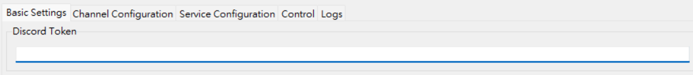
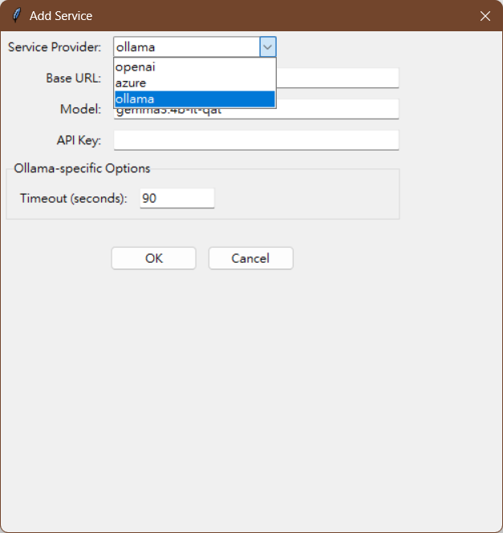
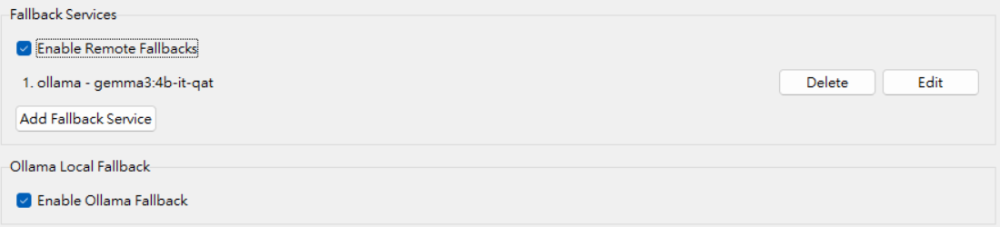
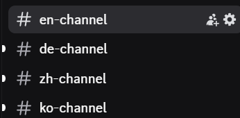

# Discord 翻譯機器人

一個Discord機器人，可自動在不同語言頻道之間翻譯訊息，具有多層次備援翻譯系統和圖形用戶界面，便於配置。

## 功能特點

- **多語言支持**：自動檢測並在已配置的語言頻道之間翻譯訊息
- **頻道類型**：
  - 標準 (standard, 讀/寫)
  - 唯讀 (read_only, 僅讀取訊息，不翻譯)
  - 唯寫 (write_only, 僅接收翻譯結果)
- **備援翻譯系統**：
  - 主要翻譯服務 (支持OpenAI API的服務商, Azure, Ollama本地支持等)
  - 可設置多個遠端備援服務
  - 本地Ollama備援支持
- **智能文本處理**：
  - CJK字符感知的文本長度計算
  - 長文本自動語言分離
  - 保留Markdown格式的翻譯
- **訊息編輯支持**：當原始訊息被編輯時自動更新翻譯
- **附件處理**：顯示內嵌圖片和附件連結
- **圖形用戶界面**：通過視覺界面輕鬆配置
- **配置管理**：基於YAML的配置與UI編輯器

## 系統要求

- Python 3.8或更高版本
- Discord機器人令牌 (Bot Token)
- 翻譯服務的API密鑰 (OpenRouter, Azure等)
- 可選：本地Ollama安裝

## 快速安裝

### Windows
1. 雙擊`install.bat`
2. 按照屏幕上的指示操作

### Linux/Ubuntu
1. 下載`install.sh`
2. 使其可執行：`chmod +x install.sh`
3. 執行：`./install.sh`

## 啟動機器人

安裝完成後，您有以下選項：

### Windows
- `start-bot.bat` - 僅啟動機器人(命令行啟動)
- `start-ui.bat` - 啟動UI界面（可以從UI控制機器人）

### Linux/Ubuntu
- `./start-bot.sh` - 僅啟動機器人
- `./start-ui.sh` - 啟動UI界面（可以從UI控制機器人）

## 配置

### 首次設置

1. 運行UI生成`config.yaml`並配置設置：
   - Windows：雙擊`start-ui.bat`
   - Linux：運行`./start-ui.sh`
2. 配置Discord令牌：
   - 從[Discord開發者平台](https://discord.com/developers/applications)獲取令牌
   - 啟用Message Content Intent和所需權限
   - 將令牌添加到配置中
3. 使用UI設置翻譯服務
4. 使用"保存配置"按鈕保存配置
5. 使用UI中的"啟動機器人"按鈕啟動機器人

### 使用UI界面

圖形界面提供完整控制：
- 配置Discord令牌和API密鑰
首先取得[Discord token](https://docs.unified.to/guides/how_to_get_your_discord_oauth_2_credentials_and_bot_token "Tutorial")

- 設置翻譯服務（主要和備援）
主要服務的設置與備援服務大同小異

亦可藉由ollama使用本地llm翻譯，Url請設置為``https://localhost:11434``

啟動遠端或本地備援服務

- 添加/編輯/刪除不同類型的頻道
使用基於[ISO 693-3](https://en.wikipedia.org/wiki/ISO_639-3 "Wikipedia")的語言標籤來設定翻譯語言
可選擇頻道類型Standard能讀取或接收翻譯訊息、read_only僅讀取訊息不接收翻譯、write_only僅接收翻譯不讀取訊息
請自行到Discord複製頻道ID

- 配置翻譯設置（語氣、特殊指令）
可以額外設置翻譯語氣與特殊指令、以及長文時要將不同語言分開處理的字數

- 存檔並啟用機器人

- 監控機器人狀態和日誌
發出訊息做測試

一次將翻譯發送到設定的頻道

所有頻道將會以設定的語言同步內容


### 手動配置範例

直接編輯`config.yaml`：

```yaml
api_keys:
  discord_token: 您的_DISCORD_令牌

channels:
  standard:
    en: [1234567890123456789]
    zh-TW: [9876543210987654321]
  read_only:
    ja: [1111111111111111111]
  write_only:
    ko: [2222222222222222222]

translation_services:
  primary:
    provider: openrouter
    base_url: https://openrouter.ai/api/v1
    model: google/gemma-3-27b-it
    api_key: 您的_API_密鑰
  
  enable_remote_fallback: true
  remote_fallbacks:
    - provider: openrouter
      base_url: https://openrouter.ai/api/v1
      model: google/gemma-3-12b-it
      api_key: 您的_API_密鑰
    - provider: ollama
      base_url: http://localhost:11434
      model: gemma3:4b-it-qat
      api_key: null
      timeout: 90
  
  enable_ollama_fallback: true

settings:
  translation_tone: ''  # casual, formal, professional, friendly
  special_instructions: ''
  language_separation_threshold: 1200
```

## 機器人權限

您的Discord機器人需要以下權限：
- 讀取訊息
- 發送訊息
- 使用斜杠命令（可選）
- 讀取訊息歷史
- 管理訊息（用於編輯翻譯）

## 翻譯服務

### 支持的提供商

1. **OpenRouter或其他支持OpenAI API的供應商**
   - 多種模型選項
   - 合理的價格
   - 簡易設置

2. **Azure OpenAI**
   - 企業級
   - 需要Azure訂閱
   - 需要更多配置

3. **Ollama**
   - 本地部署
   - 無API費用
   - 需要本地設置

### 添加新提供商

該系統設計為支持OpenAI兼容的API。您可以通過以下方式添加新提供商：
- 在`remote_fallbacks`中添加其配置
- 確保它們支持OpenAI API格式

## 高級功能

### 語言分離

當文本超過閾值時，機器人會自動分離語言進行翻譯，提高包含CJK字符的長文本的成功率。

### 訊息編輯

當您編輯受監視頻道中的訊息時，機器人會自動更新所有翻譯。

### 錯誤處理

全面的錯誤處理與詳細日誌記錄，幫助跟踪和解決問題。

## 故障排除

### 常見問題

1. **機器人沒有響應**
   - 檢查是否啟用了Message Content Intent
   - 驗證Discord中的機器人權限
   - 檢查日誌中的API錯誤

2. **翻譯失敗**
   - 驗證API密鑰是否正確
   - 檢查您的API服務是否正在運行
   - 查找日誌中的速率限制訊息

3. **Ollama連接問題**
   - 確保Ollama正在運行：`ollama serve`
   - 檢查配置中的正確基本URL
   - 驗證模型是否已下載：`ollama pull 模型名稱`

### 調試信息

通過在`bot.py`中將日誌級別設置為`DEBUG`來啟用調試日誌：
```python
logging.basicConfig(level=logging.DEBUG, ...)
```
